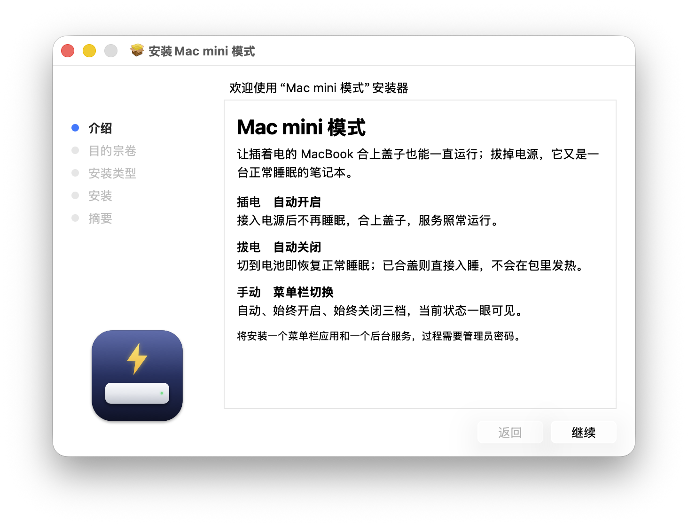

<p align="center">
  
</p>

<h1 align="center">Mac mini 模式</h1>

<p align="center">让插着电的 MacBook 合上盖子也能一直运行；拔掉电源，它又是一台正常睡眠的笔记本。</p>

## 功能

- **插电自动开启**：接入电源后不再睡眠，合盖、不接显示器也照常运行。
- **拔电自动关闭**：切到电池立即恢复正常睡眠；已合盖则直接入睡，不会在包里发热。
- **菜单栏切换**：自动、始终开启、始终关闭三档，当前状态一眼可见。

## 安装

到 [Releases](../../releases) 下载最新的 `.pkg`，双击安装即可，装完立即生效。

支持 macOS 13 及以上，Apple 芯片和 Intel 均可。

<p align="center">
  
</p>

## 卸载

```bash
sudo /Applications/MacMiniMode.app/Contents/Resources/uninstall.sh
```

## 许可

[MIT](LICENSE)
