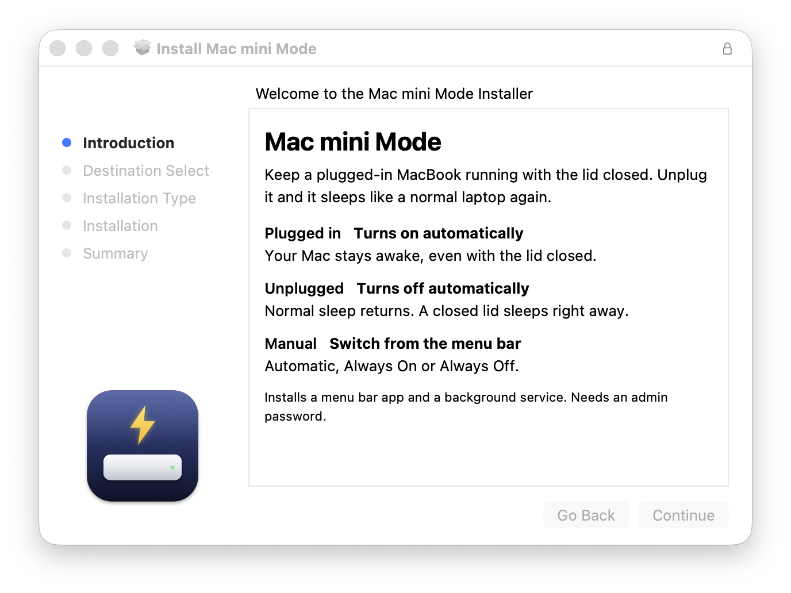

<p align="center">
  
</p>

<h1 align="center">Mac mini Mode</h1>

<p align="center">Keep a plugged-in MacBook running with the lid closed. Unplug it and it sleeps like a normal laptop again.</p>

<p align="center">
  <a href="https://github.com/Pama-Lee/MacMiniMode/releases/latest/download/MacMiniMode.pkg"></a>
  &nbsp;
  <a href="https://github.com/Pama-Lee/MacMiniMode/releases/latest/download/MacMiniMode.pkg"></a>
</p>

<p align="center"><b>English</b> · <a href="README.zh-CN.md">简体中文（安装说明）</a></p>

## Install

1. Click **Download for macOS** above to get `MacMiniMode.pkg`.
2. Double-click it and follow the installer. You will be asked for your Mac password once.
3. A new icon appears in the menu bar. It is already working, no restart needed.

The installer is signed and notarized by Apple, so macOS opens it without warnings. Requires macOS 12 or later, on Apple silicon or Intel.

<p align="center">
  
</p>

## What it does

Mac mini Mode turns a MacBook into an always-on home server or headless Mac. It gives you clamshell mode without an external display or a dummy HDMI plug, and there is no `caffeinate` or `sudo pmset disablesleep` to remember. Because it follows the power adapter, your MacBook never stays awake inside your bag.

- **On when plugged in**: sleep is disabled on AC power, so your Mac keeps running with the lid closed and no display attached.
- **Off when unplugged**: normal sleep returns on battery. If the lid is already closed, the Mac sleeps right away.
- **Menu bar control**: switch between Automatic, Always On and Always Off, and see the current state at a glance.

## Updates

Once a day the app asks GitHub whether a newer version exists. If so it downloads the installer, verifies its signature, and asks before installing; Install opens the system installer. To turn this off, uncheck **Check for Updates Automatically** in the menu and use **Check for Updates…** when you want.

## Troubleshooting

Update to the latest version first. If your Mac still sleeps with the lid closed, choose **View Log** from the menu bar icon and post it in [Issues](../../issues). A common cause is remote desktop or cleaner software that rewrites power settings on a timer; the app now restores the setting right away and notes it in the log.

## Uninstall

```bash
sudo /Applications/MacMiniMode.app/Contents/Resources/uninstall.sh
```

## License

[MIT](LICENSE)
